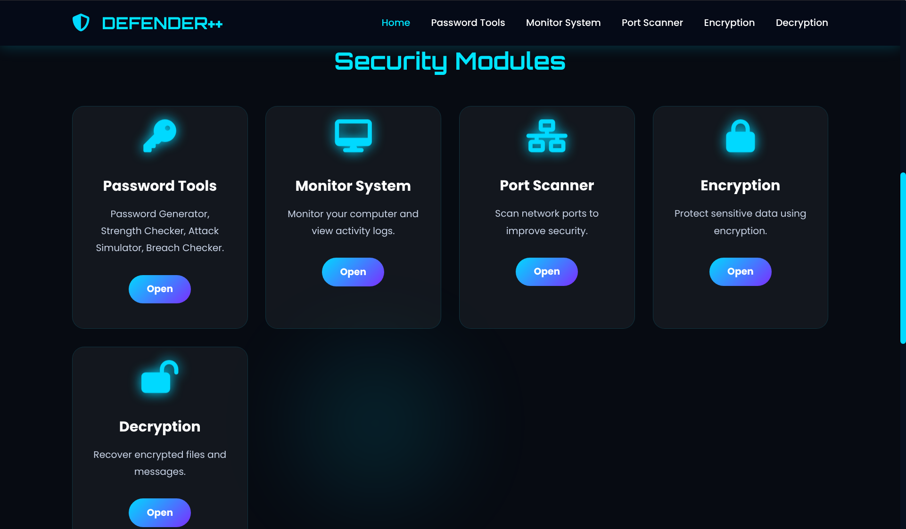
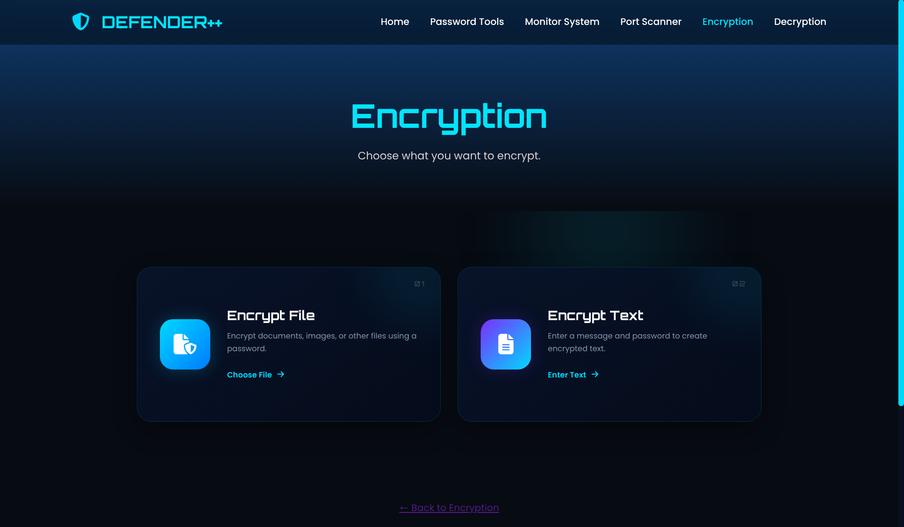
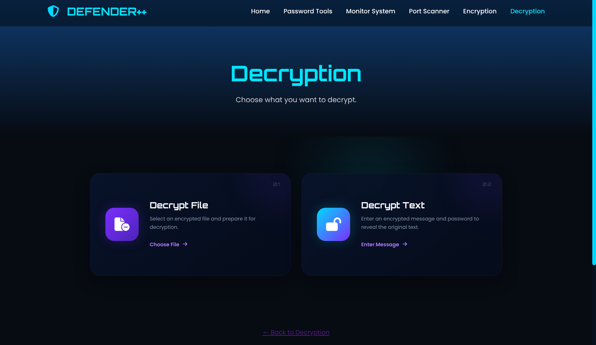
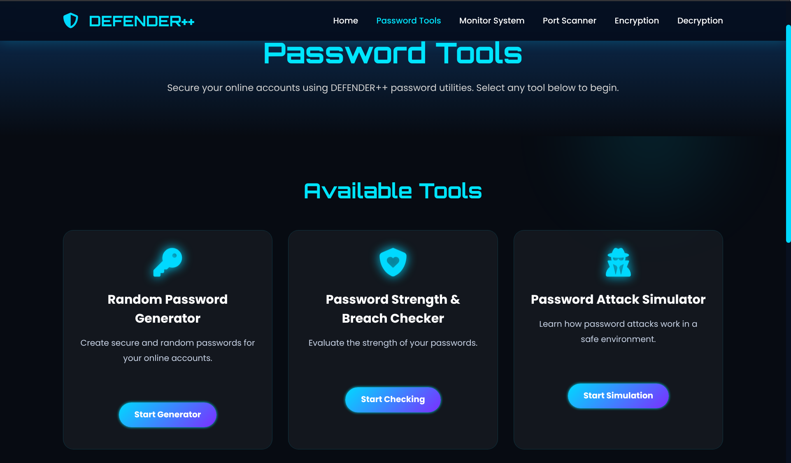
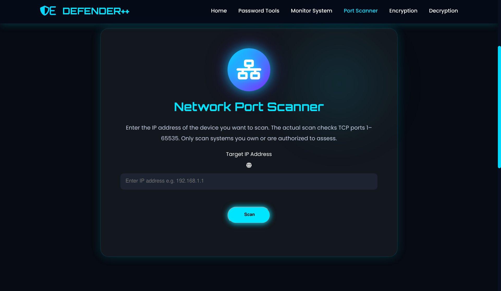
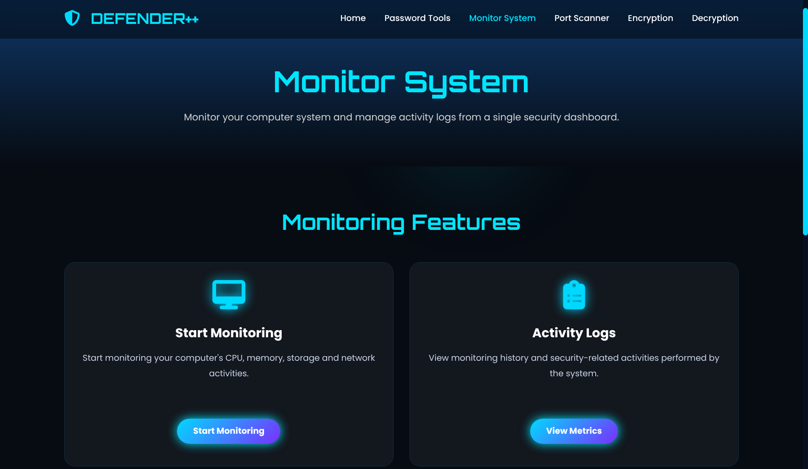

# 🛡️ DEFENDER++

> **Protect • Monitor • Encrypt • Secure**

**DEFENDER++** is a C++-based cybersecurity toolkit that combines practical security utilities with a web-based interface.

The project provides tools for **password security, encryption and decryption, network port scanning, and system monitoring** through a custom C++ HTTP server and API layer.

It is designed as an educational project for exploring **C++, networking, cryptography, cybersecurity concepts, HTTP servers, APIs, and frontend/backend architecture**.

> ⚠️ **Educational & Defensive Use Only**
> Use DEFENDER++ only on systems, networks, files, and credentials that you own or have explicit permission to test.

---

## ✨ Features

### 🔐 Password Tools

DEFENDER++ includes multiple password-security utilities.

#### 🎲 Random Password Generator

Generate random passwords using selectable character sets.

* Lowercase letters
* Uppercase letters
* Numbers
* Symbols
* Configurable password length

---

#### 📊 Password Strength & Breach Checker

Analyze a password and evaluate its security characteristics.

The checker can analyze:

* Password length
* Uppercase characters
* Lowercase characters
* Numbers
* Symbols
* Repeated characters
* Common-password status
* Overall password strength

A local password dictionary is included for common-password checking.

---

#### 🧪 Password Attack Simulator

An educational simulator for understanding password-search complexity.

It can demonstrate:

* Password search-space size
* Possible combinations
* Estimated attack time
* The effect of attempts-per-second
* Why longer and more unpredictable passwords are stronger

> The simulator is intended for controlled educational demonstrations and security awareness.

---

# 🔒 Encryption & Decryption

DEFENDER++ supports encryption and decryption of both **text and files**.

### Text

* Encrypt text using a password
* Decrypt previously encrypted text
* Base64 encoding/decoding utilities
* Dedicated frontend interfaces

### Files

* Encrypt files
* Decrypt encrypted files
* Upload files through the web interface
* Process files through backend API endpoints

The project separates encryption/decryption functionality into dedicated backend modules and API handlers.

---

# 🌐 Port Scanner

DEFENDER++ includes a C++ network port-scanning utility.

The port scanner can:

* Accept a target IP address
* Scan common ports
* Identify accessible/open ports
* Return scanning results through the API
* Display results through the web interface

This feature is intended for **network-awareness and authorized security testing**.

> ⚠️ Only scan systems and networks for which you have permission.

---

# 🖥️ System Monitor

The system-monitor component provides system information through the backend and web interface.

It includes:

* System metrics
* Activity monitoring
* Activity logging
* Backend API integration
* Browser-based monitoring dashboard

The project also maintains an activity log through the system-monitor component.

---

# 🌍 Custom C++ HTTP Server

One of the main components of DEFENDER++ is its own lightweight HTTP server written in **C++**.

Instead of relying on a separate web server, DEFENDER++ uses its C++ server to provide both the frontend and backend API.

### Server responsibilities

* Serve frontend static files
* Handle HTTP requests
* Route API requests
* Process JSON requests
* Handle file uploads
* Return HTTP responses
* Connect frontend requests with C++ backend functionality

The basic routing architecture is:

```text
                         HTTP Request
                              │
                              ▼
                    ┌──────────────────┐
                    │   C++ HTTP Server │
                    └────────┬─────────┘
                             │
                    ┌────────┴─────────┐
                    │      Router      │
                    └────────┬─────────┘
                             │
              ┌──────────────┴──────────────┐
              │                             │
          /api/*                       Other URLs
              │                             │
              ▼                             ▼
      Backend API Handlers           Static Frontend
              │                             │
              ▼                             ▼
       C++ Security Tools            HTML/CSS/JS
```

This allows the same application to act as both the **web server** and the **cybersecurity backend**.

---

# 🏗️ Architecture

DEFENDER++ follows a modular frontend/backend architecture:

```text
                         ┌──────────────────────┐
                         │      Web Browser     │
                         │    HTML / CSS / JS   │
                         └──────────┬───────────┘
                                    │
                                  HTTP
                                    │
                                    ▼
                         ┌──────────────────────┐
                         │    C++ HTTP Server   │
                         │                      │
                         │  HTTP + Router + API │
                         └──────────┬───────────┘
                                    │
               ┌────────────────────┼────────────────────┐
               │                    │                    │
               ▼                    ▼                    ▼
       ┌──────────────┐     ┌──────────────┐     ┌──────────────┐
       │  Encryption  │     │   Password   │     │    System    │
       │  /Decryption │     │    Tools     │     │    Monitor   │
       └──────────────┘     └──────────────┘     └──────────────┘
               │                    │                    │
               └────────────────────┼────────────────────┘
                                    │
                                    ▼
                         ┌──────────────────────┐
                         │   Utility Modules    │
                         │ File / JSON / HTTP   │
                         └──────────────────────┘
```

---

# 📁 Project Structure

```text
└── Defender
    ├── backend
    │   ├── api
    │   │   ├── decryption.cpp
    │   │   ├── decryption.h
    │   │   ├── encryption.cpp
    │   │   ├── encryption.h
    │   │   ├── password_tools.cpp
    │   │   ├── password_tools.h
    │   │   ├── port_scanner.cpp
    │   │   ├── port_scanner.h
    │   │   ├── system_monitor.cpp
    │   │   └── system_monitor.h
    │   ├── decryption-system
    │   │   ├── decryption-system-files
    │   │   │   └── decryption-system-files.cpp
    │   │   └── decryption-system-text
    │   │       ├── base64.cpp
    │   │       ├── base64.h
    │   │       └── decryption-system-text.cpp
    │   ├── encryption-system
    │   │   ├── encryption-system-files
    │   │   │   └── encryption-system-file.cpp
    │   │   └── encryption-system-text
    │   │       ├── base64.cpp
    │   │       ├── base64.h
    │   │       ├── encrpytion-system-text.cpp
    │   │       └── encryption_core.h
    │   ├── passwordTools
    │   │   ├── attacking-simulator
    │   │   │   ├── attack-simu.cpp
    │   │   │   └── password_analysis.h
    │   │   ├── password-strength-and-breach-checker
    │   │   │   ├── cli_strength_checker.cpp
    │   │   │   ├── passDictionary.txt
    │   │   │   ├── password.cpp
    │   │   │   └── password.h
    │   │   └── random-password-generator
    │   │       ├── pass.cpp
    │   │       ├── password_generator
    │   │       └── password_generator.h
    │   ├── port-scanner.png
    │   ├── server
    │   │   ├── http_server.cpp
    │   │   ├── http_server.h
    │   │   ├── main.cpp
    │   │   ├── router.cpp
    │   │   ├── router.h
    │   │   ├── static_files.cpp
    │   │   └── static_files.h
    │   ├── system-monitor
    │   │   ├── activity_log.txt
    │   │   ├── system-monitor
    │   │   └── system-monitor.cpp
    │   └── utils
    │       ├── file_utils.cpp
    │       ├── file_utils.h
    │       ├── json_utils.cpp
    │       ├── json_utils.h
    │       ├── request.h
    │       └── response.h
    ├── CMakeLists.txt
    ├── frontend
    │   ├── decryption-system
    │   │   ├── decryption.css
    │   │   ├── decryption.html
    │   │   └── select-decryption
    │   │       ├── decrypt-file
    │   │       │   ├── decrypt-file.css
    │   │       │   ├── decrypt-file.html
    │   │       │   └── decrypt-file.js
    │   │       ├── decryption.css
    │   │       ├── decryption.html
    │   │       └── decrypt-text
    │   │           ├── decryption-text.css
    │   │           ├── decrypt-text.html
    │   │           └── decrypt-text.js
    │   ├── encryption-system
    │   │   ├── encryption.html
    │   │   └── select-encryption
    │   │       ├── encrypt-file
    │   │       │   ├── encrypt-file.css
    │   │       │   ├── encrypt-file.html
    │   │       │   └── encrypt-file.js
    │   │       ├── encryption.css
    │   │       ├── encryption.html
    │   │       └── encrypt-text
    │   │           ├── encrypt-text.css
    │   │           ├── encrypt-text.html
    │   │           └── encrypt-text.js
    │   ├── index.html
    │   ├── js
    │   │   └── script.js
    │   ├── passwordTools
    │   │   ├── attacking-simulator
    │   │   │   ├── attack-simulator.js
    │   │   │   └── password-attack-simulator.html
    │   │   ├── password-strength-and-breach-checker
    │   │   │   ├── breach-strength-checker.html
    │   │   │   └── js
    │   │   │       └── password-checker.js
    │   │   ├── password-tools-final.html
    │   │   └── random-password-generator
    │   │       ├── password-generator.css
    │   │       ├── password-generator.js
    │   │       └── random-password.html
    │   ├── port-scanner
    │   │   ├── port-scanner.css
    │   │   ├── port-scanner.html
    │   │   └── port-scanner.js
    │   ├── style.css
    │   └── system-monitor
    │       ├── metrics.html
    │       ├── metrics.js
    │       ├── monitor.html
    │       └── monitor.js
    ├── README.md
    ├── screenshots
    │   ├── dashboard.png
    │   ├── decryption.png
    │   ├── Defender.png
    │   ├── encryption.png
    │   ├── password-tools.png
    │   ├── port-scanner.png
    │   └── system-monitor.png
    └── start.sh

```

---

# 🧰 Technologies Used

| Technology        | Purpose                                         |
| ----------------- | ----------------------------------------------- |
| **C++**           | Core backend and cybersecurity functionality    |
| **CMake**         | Build configuration and project management      |
| **HTML5**         | Web interface structure                         |
| **CSS3**          | Frontend styling                                |
| **JavaScript**    | Frontend functionality and API communication    |
| **JSON**          | Data exchange between frontend and backend      |
| **HTTP**          | Client-server communication                     |
| **POSIX Sockets** | Networking and HTTP/port-scanning functionality |
| **Base64**        | Encoding/decoding support                       |
| **Linux**         | Development and runtime environment             |
| **Font Awesome**  | Frontend icons                                  |
| **Google Fonts**  | Frontend typography                             |

---

# ⚙️ Requirements

DEFENDER++ is primarily developed for Linux.

You need:

* Linux
* C++ compiler
* C++17 or newer
* CMake
* Make or Ninja
* Git
* Modern web browser

## Arch Linux

```bash
sudo pacman -S base-devel cmake git
```

## Debian / Ubuntu

```bash
sudo apt update
sudo apt install build-essential cmake git
```

---

# 🚀 Getting Started

## 1. Clone the Repository

```bash
git clone https://github.com/krishal-sec/Defender.git
```

Enter the project directory:

```bash
cd Defender
```

---

## 2. Build and Start

The project includes a startup script:

```bash
chmod +x start.sh
./start.sh
```

The script builds/starts the application according to the project's configuration.

When the server starts, it will display the local address to access the web interface.

For example:

```text
Defender running at http://localhost:<port>
```

Open the displayed address in your browser.

---

# 🔨 Manual CMake Build

If you prefer to build manually:

```bash
cmake -S . -B build
cmake --build build
```

After compilation, run the generated server executable according to the CMake configuration.

---

# 🖥️ Using DEFENDER++

Once the server is running, open the local URL displayed in the terminal.

The dashboard provides access to:

```text
Defender
│
├── 🔐 Encryption
│   ├── Encrypt Text
│   └── Encrypt File
│
├── 🔓 Decryption
│   ├── Decrypt Text
│   └── Decrypt File
│
├── 🔑 Password Tools
│   ├── Random Password Generator
│   ├── Password Strength & Breach Checker
│   └── Password Attack Simulator
│
├── 🌐 Port Scanner
│
└── 🖥️ System Monitor
```

---

# 🔌 API Overview

The C++ backend exposes API endpoints used by the frontend.

| Method | Endpoint                        | Purpose                              |
| ------ | ------------------------------- | ------------------------------------ |
| `GET`  | `/api/system/metrics`           | Retrieve system metrics              |
| `GET`  | `/api/system/activity-log`      | Retrieve system activity information |
| `POST` | `/api/password/generate`        | Generate a password                  |
| `POST` | `/api/password/check`           | Analyze password strength            |
| `POST` | `/api/password/attack-simulate` | Simulate password-search complexity  |
| `POST` | `/api/scan/ports`               | Scan common ports                    |
| `POST` | `/api/encrypt/text`             | Encrypt text                         |
| `POST` | `/api/decrypt/text`             | Decrypt text                         |
| `POST` | `/api/encrypt/file`             | Encrypt an uploaded file             |
| `POST` | `/api/decrypt/file`             | Decrypt an uploaded file             |

The frontend communicates with these endpoints using JavaScript.

---

# 🔄 Request Flow

A typical request follows this architecture:

```text
User
 │
 ▼
Web Interface
 │
 │ JavaScript / HTTP
 ▼
C++ HTTP Server
 │
 ▼
Router
 │
 ├── /api/password/*
 ├── /api/encrypt/*
 ├── /api/decrypt/*
 ├── /api/scan/*
 └── /api/system/*
 │
 ▼
Backend API
 │
 ▼
Security / System Module
 │
 ▼
JSON / HTTP Response
 │
 ▼
Web Interface
```

For non-API requests:

```text
Browser
   │
   ▼
C++ HTTP Server
   │
   ▼
Router
   │
   └── Static File Handler
             │
             ▼
       HTML / CSS / JS
```

---

# 🔐 Security Notes

DEFENDER++ is intended for:

* Education
* Cybersecurity learning
* Development
* Security awareness
* Authorized testing

### Network Scanning

Do not scan networks or hosts without authorization.

Only use the port scanner against systems you own or are explicitly authorized to test.

### Password Tools

Do not use password-analysis or attack-simulation features against accounts or credentials that you do not own or have permission to test.

### Encryption

The project's encryption implementation is intended primarily for educational purposes.

Do not assume that an educational cryptographic implementation is suitable for protecting highly sensitive production data.

For production applications, use well-established, independently audited cryptographic libraries and secure key-management practices.

### Sensitive Data

Treat the following as sensitive:

* Passwords
* Generated credentials
* Uploaded files
* Encryption keys
* Private information
* Activity logs

Do not commit sensitive information to the repository.

---

# 🎯 Project Goals

DEFENDER++ was created to explore and demonstrate fundamental concepts in:

### Cybersecurity

* Password security
* Password complexity
* Encryption and decryption
* Network port awareness
* System monitoring

### C++

* Modular C++ development
* File handling
* Networking
* HTTP server development
* Header/source organization
* API implementation

### Web Development

* HTML
* CSS
* JavaScript
* Frontend/backend communication
* JSON
* HTTP APIs

### Software Architecture

* Client-server architecture
* Routing
* API abstraction
* Static file serving
* Modular backend design

---

# 🧠 What This Project Demonstrates

```text
                    DEFENDER++
                        │
        ┌───────────────┼───────────────┐
        │               │               │
        ▼               ▼               ▼
   Cybersecurity     Networking     Web Development
        │               │               │
        ├─ Encryption   ├─ HTTP       ├─ HTML
        ├─ Passwords    ├─ TCP        ├─ CSS
        ├─ Port Scan    └─ Sockets    └─ JavaScript
        └─ Monitoring
                        │
                        ▼
                 C++ Backend
                        │
                        ▼
                 Custom HTTP Server
```

The project therefore acts as a practical demonstration of how multiple areas of software development can be combined into one application.

---

# 🛠️ Development

The codebase is separated into logical components.

## Backend API

```text
backend/api/
```

Contains API-level handlers that connect HTTP requests with the underlying functionality.

## Security Modules

```text
backend/encryption-system/
backend/decryption-system/
backend/passwordTools/
```

Contains the core security-related implementations.

## Server

```text
backend/server/
```

Contains:

* HTTP server
* Router
* Static file handling
* Server entry point

## Utilities

```text
backend/utils/
```

Contains reusable components for:

* File handling
* JSON processing
* HTTP requests
* HTTP responses

## Frontend

```text
frontend/
```

Contains the browser-based user interface and JavaScript API communication.

---

# 🧪 Testing

The major components of the application should be tested individually as well as through the complete web interface.

```text
✓ C++ compilation
✓ HTTP server
✓ API routing
✓ Static file serving
✓ Text encryption
✓ Text decryption
✓ File encryption
✓ File decryption
✓ Password generation
✓ Password strength checking
✓ Password attack simulation
✓ Port scanning
✓ System monitoring
✓ Frontend/API communication
```

---

# 🔮 Future Improvements

Planned or possible improvements include:

* [ ] HTTPS/TLS support
* [ ] Improved cryptographic implementation
* [ ] Stronger key derivation
* [ ] Authentication and authorization
* [ ] More comprehensive system monitoring
* [ ] Expanded port-scanning functionality
* [ ] Additional password-security analysis
* [ ] Improved error handling
* [ ] Better logging
* [ ] Automated unit testing
* [ ] Integration testing
* [ ] API documentation
* [ ] Improved frontend responsiveness
* [ ] Docker support
* [ ] Improved CMake configuration
* [ ] Security hardening
* [ ] More detailed documentation

---

## 📸 Screenshots

### 🏠 Dashboard

<p align="center">
  
</p>

### 🔐 Encryption & Decryption

<p align="center">
  
</p>

<p align="center">
  
</p>

### 🔑 Password Tools

<p align="center">
  
</p>

### 🌐 Port Scanner

<p align="center">
  
</p>

### 🖥️ System Monitor

<p align="center">
  
</p>

---

# 🤝 Contributing

Contributions, suggestions, bug reports, and improvements are welcome.

Before submitting changes:

1. Test the feature locally.
2. Keep frontend and backend changes organized.
3. Document new API endpoints.
4. Keep security-sensitive functionality clearly documented.
5. Do not commit passwords, private keys, credentials, personal files, or other sensitive information.

---

# 📜 License

This project does not currently specify an open-source license.

If you intend to allow public reuse, modification, and redistribution, consider adding an appropriate license such as:

* MIT
* Apache-2.0
* GPL-3.0

Until a license is added, the repository should not be assumed to grant permission to reuse the code.

---

# 👨‍💻 Author

**Naman Karna** /
**Krishal Khatri** /
**Nikhil Kumar Verma** /
**Krishna Bahadur Thapa** /


---

# ⚠️ Disclaimer

DEFENDER++ is an **educational cybersecurity toolkit**.

The tools included in this project are intended for learning, security awareness, development, and authorized testing.

The author is not responsible for misuse of the software. Always obtain appropriate authorization before scanning networks, analyzing credentials, or testing security-related functionality on systems that you do not own.

---

<div align="center">

### 🛡️ DEFENDER++

**Protect • Monitor • Encrypt • Secure**

⭐ If you find the project interesting, consider giving it a star on GitHub.

</div>
